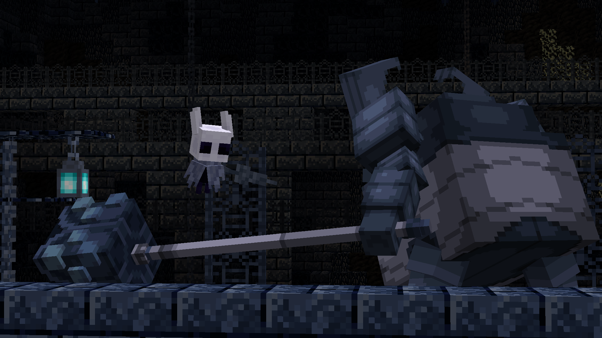
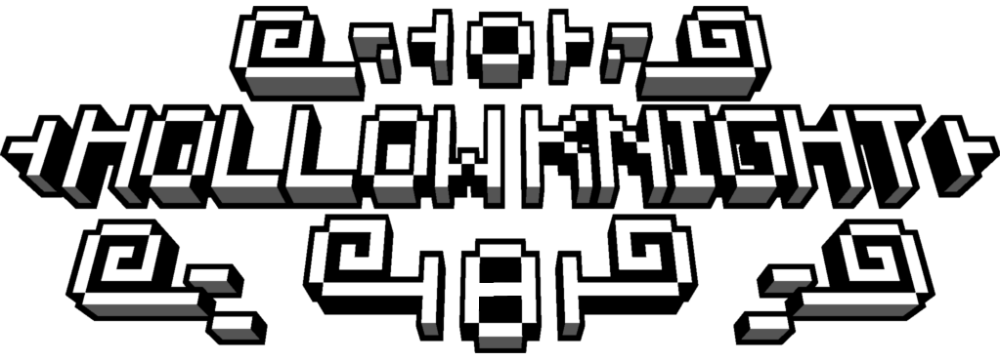
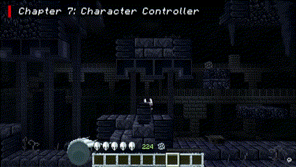
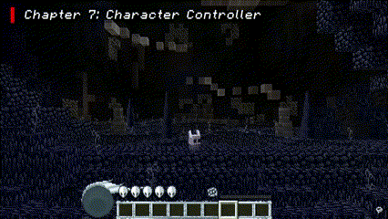
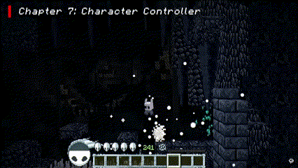
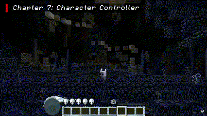
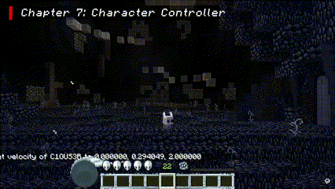
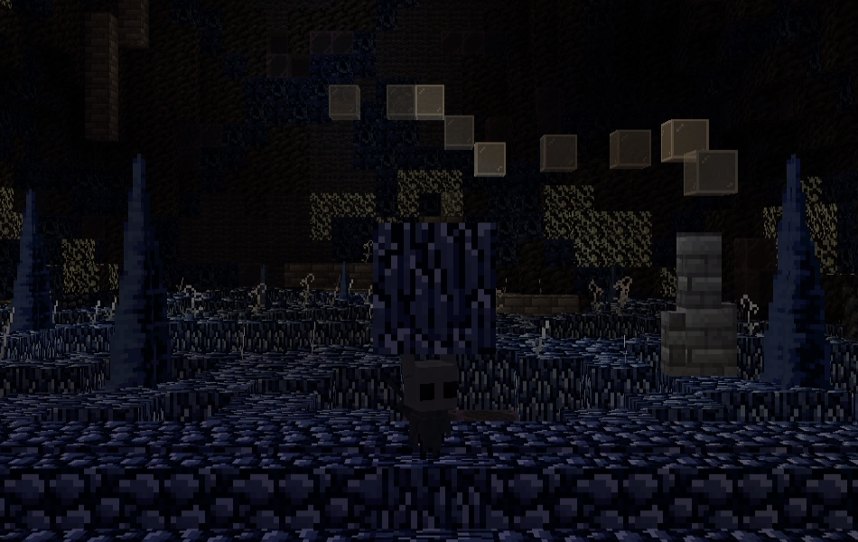
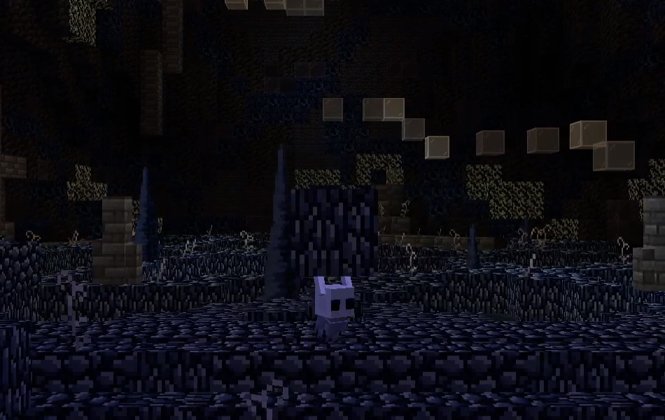

# Clouser's Hollow Knight physics mod

## Player's physics override mod for [Clouser's Hollow Knight minecraft map](https://youtu.be/SB0jRHjh9kk)

    

    
    
    

# Features

## Hollow Knight physics

In vanilla Minecraft, when movement keys are released, player's velocity is conserved. This means that if the player is catapulted in the air, its trajectory describes a parabola, only influenced by gravity and air friction. This also means that when the player presses movement keys again, they will first have to cancel his speed in one direction before he can start increasing it in the other direction.

But in Hollow Knight, it's different.
As soon as the player releases movement keys, they stops mid-air, and can immediately start to move in another direction.

In Minecraft, the jump is very basic. You press jump, the player jumps a certain height, which normally is always the same.

In Hollow Knight the jump key is pressure sensitive. It means that the longer you press it, the higher you go. It's as simple as that. In some circumstances, the player also has a double jump ability, which allows them to repeat the pressure sensitive jump mid-air.

> [!NOTE]
> The Hollow Knight physics are not enabled by default. See [Gamerules section](#gamerules) for more informations.

## Commands

### /velocity
The velocity command allows to modify entities velocities. Inputed velocities are in blocks per ticks.

#### Syntax:
- `/velocity <velocity> [pausePhysicsTicks]`
Sets the velocity of the player to the inputed x, y and z velocity. The velocity can be relative.
The optionnal argument pausePhysicsTicks allows to pause the Hollow Knight physics during a certain amount of ticks. Default value: 0
- `/velocity <entity> <velocity> [pausePhysicsTicks]`
Sets the velocity of the targeted entities to the inputed x, y and z velocity. The velocity can be relative.
The optionnal argument pausePhysicsTicks allows to pause the Hollow Knight physics during a certain amount of ticks. Default value: 0
#### Examples:
| Command | Description |
| --- | --- |
| `/velocity ~ 1 ~` | Throws the player in the air at one block per tick |
| `/velocity @e[type=Pig] 0 0 0` | Stops the movement of all the pigs |
| `/velocity @p ~8.4 0 0 7` | Increases the nearest player X velocity by 8.4 blocks per tick and disables Hollow Knight physics for 20 ticks |

### /clearchat
The clearchat command allows to clear the chat of targeted players.
#### Syntax:
- `/clearchat`
Clears the player chat.
- `/clearchat <player>`
Clears the chat of the specified players.
#### Examples:
| Command | Description |
| --- | --- |
| `/clearchat` | Clears the player chat |
| `/clearchat @a` | Clears the chat of all players |

### /perspective
The perspective command allows to modify players perspectives.
#### Syntax:
- `/perspective (firstPerson|thirdPersonBack|thirdPersonFront)`
Sets the player's perspective to the specified one.
- `/velocity <player> (firstPerson|thirdPersonBack|thirdPersonFront)`
Sets the targeted players' perspectives to the specified one.
#### Examples:
| Command | Description |
| --- | --- |
| `/perspective thirdPersonBack` | Sets the player's perspective to third person |
| `/perspective @a firstPerson` | Sets all players" perspectives to first person |

## Gamerules

| Rule name | Description | Default value | Type |
| --- | --- | --- | --- |
| `hollowKnightPhysicsOn` | Whether Hollow Knight physics are enabled | `false` | Bool |
| `canPlayerMove` | Whether the players can move | `true` | Bool |
| `isKnockbackOn` | Whether the players can be knockbacked | `true` | Bool |
| `axisXenabled` | Whether the players can move their heads horizontally | `true` | Bool |
| `axisYenabled` | Whether the players can move their heads vertically | `true` | Bool |
| `hollowKnightJump` | Whether the Hollow Knight jump physics are on | `false` | Bool |
| `canDoubleJump` | Whether the players can double jump with Hollow Knight jump on | `false` | Bool |
| `canPlayerJump` | Whether the players can jump | `true` | Bool |
| `perspectiveLocked` | Whether the player's perspective is locked | `false` | Bool |
| `zKeysLookOn` | Whether the forward and backward keys move the players or execute the look features of the map | `false` | Bool |
| `playerStepHeight` | Max player's step height. Default is 0.6 to allow to step on stairs or slabs | `0.6` | Double |

> [!NOTE]
> The `zKeysLookOn` command is calibrated to communicate with the map's command blocks. It'll not work outside of the map

## Light manipulation

In addition to all of these commands and gameules, this mod manipulates the entities light to always render them at full current daylight. This prevent entity darkening when its hitbox is inside a block.

| Before | After |
| --- | --- |
|  |  |

# License and credits

This mod is open-source and copyrighted under the MIT licence. Full license [here](LICENSE).

Hollow Knight is the copyright of Team Cherry. [(teamcherry.com.au)](teamcherry.com.au) [(hollowknight.com)](hollowknight.com) 'Hollow Knight' the name and logo are trademarks of Team Cherry.

    

------
